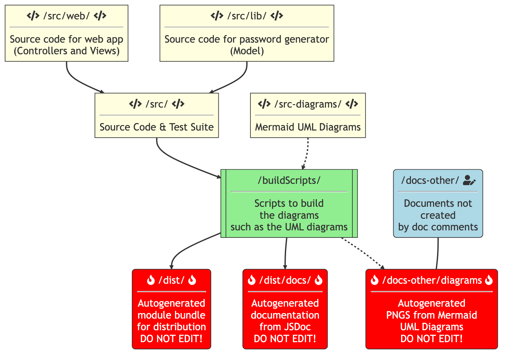

# XKPasswdJS — The Official JavaScript Port of Crypt::HSXKPasswd

[Bart Busschots](https://www.bartb.ie/) created the [Crypt::HSXKPasswd](https://metacpan.org/pod/Crypt::HSXKPasswd) Perl module to be a liberally licensed ([2-clause BSD](https://opensource.org/licenses/BSD-2-Clause)) password generator for producing secure but memorable passwords using the word-based approach made famous by the [*Correct Horse Battery Staple* XKCD comic](https://xkcd.com/936/).

 
Bart is leading this port of the Perl module to JavaScript with the [NosillaCast community](https://podfeet.com/slack) as part of the on-going Programming By Stealth blog/podcast series](https://pbs.bartificer.net) he produces with [Allison Sheridan](https://www.podfeet.com/blog/about/).

## Project Plan

The plan is to develop this port in the following broad stages:

1. **Project Skeleton** — project infrastructure and specification for direct port
   * Bart will work mostly solo with only typo-like pull requests accepted
   * Outcomes:
     * UML Class Diagram defining the API for the direct port
     * Contribution guides for developers including a project code style, a Git branching policy, and a style guide for Git commits
     * Configuration files for the project tooling, specifically WebPack (bundler), JSLint (code linter), JSDoc (documentation generator), and Jest (test suite)
     * Automations/Scripts to build the project, run the test suite, and build the documentation
2. **Direct Port** — implementation of a feature-for-feature port of the Perl module to JavaScript
   * Pull requests implementing the documented design and following the contribution guidelines will be gratefully accepted
   * The issue tracker will be opened and used to track bugs and enhancement requests
   * Outcomes:
     * An ES6 JavaScript module implementing the documented API
     * Detailed documentation
     * A Jest test suite with full code coverage
     * An official NPM package for the module
3. **Maintenance & Enhancement** — bug fixes, security patches, and feature enhancements
   * Details to be agreed upon later based on the experiences from phase 2.

**The project is currently in phase 1 — project skeleton**.

## Repository Structure

Fundamentally, the repository is a NodeJS project, so it contains the standard NodeJS files. In addition to these standard files, the project's assets are stored in the following structure:

* `/buildScripts/` — the folder containing the scripts used to build the bundled versions of the module and the module's documentation site, including its UML diagrams.
* `/dist/` — the target folder into which the build scripts will publish the bundled versions of the module, ready for distribution. **Do not edit the contents of this folder directly!**
* `/docs/` — the target folder into which the build scripts will publish the generated documentation. This folder's contents will be published at the project's website. **Do not edit the contents of this folder directly!**
* `/docs-other/` — the folder containing the parts of the documentation that are not generated from documentation comments.
* `/docs-other/diagrams/` — the target folder into which the build scripts will publish PNG versions of the project's UML diagrams. The source for these diagrams are the Mermaid files in `/src-diagrams/`. **Do not edit the contents of this folder directly!**
* `/src/` — the folder containing the module's source code and test suite.
* `/src-diagrams/` — the folder containing the source code for the UML diagrams describing the module. These files will be in Mermaid format and will be transformed into PNG files in `/docs-other/diagrams/` by a build script.

## Contributor & Developer Resources & Guides

This project is managed through GitHub. To contribute by starting or commenting on feature requests or bug reports you'll need [a free GitHub account](https://github.com/signup). The project's home on GitHub is at [github.com/bartificer/xkpasswd-js](https://github.com/bartificer/xkpasswd-js/).

### Prerequisites

If you download the raw code you'll need the following to build the project, i.e. transform the raw code into a usable JavaScript module with documentation, you'll need:

1. The most recent LTS (Long Term Support) version of the NodeJS runtime available at [nodejs.org](https://nodejs.org/)
2. A POSIX-compliant shell and terminal app capable of running Bash scripts — standard on Linux & Mac, and available for Windows through the Windows Subsystem for Linux (WSL).
   * Microsoft's documentation for installing WSL — [learn.microsoft.com/…](https://learn.microsoft.com/en-us/windows/wsl/install)
   * The official Bash documentation — [www.gnu.org/…](https://www.gnu.org/savannah-checkouts/gnu/bash/manual/bash.html)
3. Sufficient confidence on the command line to navigate to a folder and run basic commands
   * (you might find [the Taming the Terminal series](https://pbs.bartificer.net/) helpful 😉)

To contribute documentation or code changes back to the project you'll also need:

1. A supported version of the Git versioning system, and optionally a Git GUI of your choice.
   * Git's official download page — [git-scm.com/…](https://git-scm.com/downloads)
2. A working understanding of the Markdown markup language
3. A code editor, ideally with Markdown and/or JavaScript syntax highlighting.
   * To contribute code your editor of choice must support [ESLint](https://eslint.org/).

### Relevant Documentation

When altering the code you may find links to the documentation for the various technologies used within the project's code and toolchain useful:

* Mozilla's Excellent JavaScript documentation — [developer.mozilla.org/…](https://developer.mozilla.org/en-US/docs/Web/JavaScript)
* Documentation for the NPN (Node Package Manager) CLI — https://docs.npmjs.com/cli/v9/
* Documentation for the JSDoc syntax — [jsdoc.app/…](https://jsdoc.app/)
  * The best available documentation for the DocDash JSDoc theme — [github.com/…](https://github.com/clenemt/docdash)
* Documentation for the Mermaid diagram markup language — [mermaid-js.github.io/…](https://mermaid-js.github.io/mermaid/#/)
* Documentation for the project's code linter, ESLint — [eslint.org/…](https://eslint.org/docs/latest/)
* Documentation for Jest, the project's code testing tool — [jestjs.io/…](https://jestjs.io/docs/getting-started)
* Documentation for the project's bundler, Webpack — [webpack.js.org/…](https://webpack.js.org/concepts/)

### Versioning Policy

This module is versioned using the Semantic Versioning System, or [SemVer](https://semver.org/).

### Source Control Policy

1. Git commits to be merged into the `main` branch will be titled in line with the [Conventional Commits](https://www.conventionalcommits.org/) approach.
2. Commit messages will be in the active voice in line with Git best practices.
3. All contributions will be submitted via Pull request
   * Until the project reaches version 1.0.0 any contributions that make progress towards the initial implementation can be merged into the `main` branch
   * Once the project reaches version 1.0.0 all contributions must be *atomic*, i.e. must be a complete unit. For code contributions that means:
     1. All tests must pass
     2. News tests must be included to cover all new functionality
     3. The Doc Comments must be updated as appropriate
     4. The code must be in the project's style

### Style Guide

As a general rule, take your lead from the existing content. If your contributions look out of place, they're unlikely to be accepted as they are.

When writing documentation, try to keep your additions in the same voice as the existing docs. Additionally, when writing Markdown please use the following conventions:

1. Use `*` as the bullet symbol.
2. Use `**` for bold.
3. Use `_` for italics.
4. Use `#` symobls for all headings, even toplevel headings, i.e. don't use the post-fixed `:` notation.
5. When adding multi-line code blocks, include a language specifier. Use `js` to specify JavaScript.

When contributing to Mermaid Diagrams, add all class members inside the class definition block; don't use the alternative syntax that allows single members to be added in separate statements.

When writing code, be sure to have ESLint enabled in your editor so you can see when you break the project's style guide. When choosing variable names, try to be consistent with the other nearby variables.

When writing code, make sure it's in line with the project's ESLint configuration, and try to choose variable names that are in line with others in the surrounding code.

When writing doc comments:

1. Use `@param` to specify parameters (don't use `@args`).
2. Use `@returns` to describe return values (don't use `@return`).