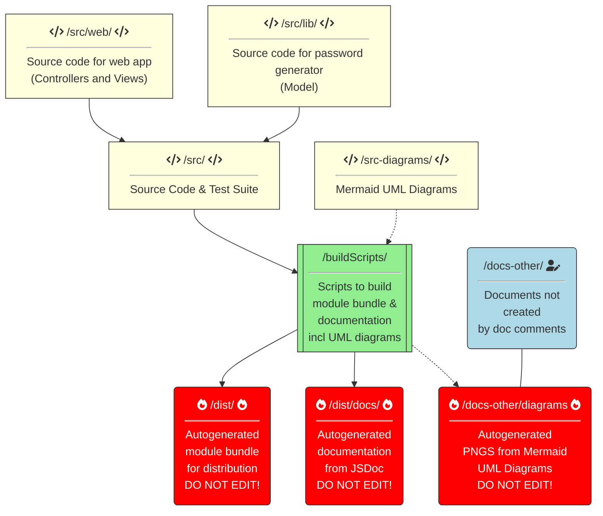

```mermaid
%%{ init: { 'flowchart': { 'curve': 'basis' } } }%%

flowchart TD
  web["fa:fa-code /src/web/ fa:fa-code<br><hr>Source code for web app<br/>(Controllers and Views)"] --> src
  lib["fa:fa-code /src/lib/ fa:fa-code<br><hr>Source code for password generator<br/>(Model)"] --> src
	src["fa:fa-code /src/ fa:fa-code<br><hr>Source Code & Test Suite"]
	--> buildScripts[["/buildScripts/<br><hr>Scripts to build<br>module bundle &<br>documentation<br>incl UML diagrams"]]
	--> dist("fa:fa-fire /dist/ fa:fa-fire<br><hr>Autogenerated <br>module bundle<br>for distribution<br>DO NOT EDIT!") & docs("fa:fa-fire /dist/docs/ fa:fa-fire<br><hr>Autogenerated<br>documentation<br>from JSDoc<br>DO NOT EDIT!")

	srcDiagrams["fa:fa-code /src-diagrams/ fa:fa-code<br><hr>Mermaid UML Diagrams"]
	.-> buildScripts
	.-> docsOtherDiagrams("fa:fa-fire /docs-other/diagrams fa:fa-fire <br><hr>Autogenerated<br>PNGS from Mermaid<br>UML Diagrams<br>DO NOT EDIT!")

	docsOther("/docs-other/ fa:fa-user-edit<br><hr>Documents not<br>created<br> by doc comments") --- docsOtherDiagrams

	classDef default stroke:#333
	classDef doNotEdit color:#ffffff, fill:#ff0000
	classDef inputSrc fill: #FFFFE0

	style buildScripts fill:#90EE90
	style docsOther fill: #ADD8E6

	class src inputSrc;
	class web inputSrc;
  class lib inputSrc;
	class dist doNotEdit;
	class docs doNotEdit;
	class srcDiagrams inputSrc;
	class docsOtherDiagrams doNotEdit;
```
