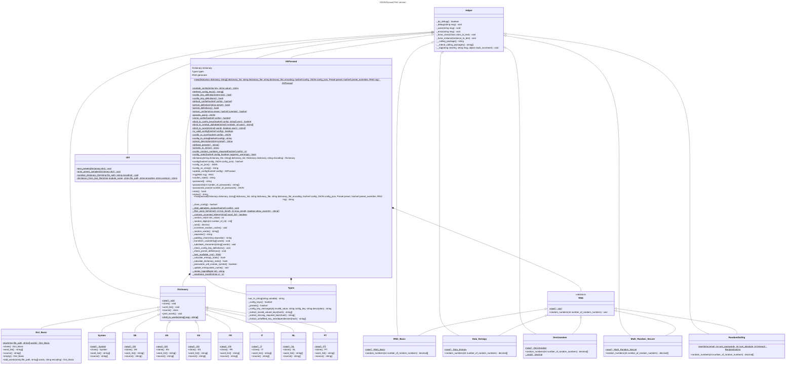

```mermaid
---
title: HSXKPasswd Perl version
---
classDiagram-v2
    Helper <|-- XKPasswd
    Helper <|-- Dictionary
    Helper <|-- RNG_Basic
    Helper <|-- Data_Entropy
    Helper <|-- DevUrandom
    Helper <|-- Math_Random_Secure
    Helper <|-- RandomDotOrg
    Helper <|-- Types
    Helper <|-- Util


    Dictionary <|-- Dict_Basic
    Dictionary <|-- System
    Dictionary <|-- DE
    Dictionary <|-- EN
    Dictionary <|-- ES
    Dictionary <|-- FR
    Dictionary <|-- IT
    Dictionary <|-- NL
    Dictionary <|-- PT

    RNG <|-- RNG_Basic
    RNG <|-- Data_Entropy
    RNG <|-- DevUrandom
    RNG <|-- Math_Random_Secure
    RNG <|-- RandomDotOrg

    XKPasswd *-- Dictionary
    XKPasswd *-- Types
    XKPasswd *-- RNG

    class XKPasswd {
        Dictionary dictionary
        Types types
        RNG generator
        +new(Dictionary dictionary, string[] dictionary_list, string dictionary_file, string dictionary_file_encoding, hashref config, JSON config_json, Preset preset, hashref preset_overrides, RNG rng )$ XKPasswd
        +module_config(string key, string value)$ string
        +defined_config_keys()$ string[]
        +config_key_definition(string key)$ hash
        +config_key_definitions()$ hash
        +default_config(hashref config)$ hashref
        +preset_definition(string preset)$ hash
        +preset_definitions()$ hash
        +preset_config(string preset, hashref override)$ hashref
        +presets_json()$ JSON
        +clone_config(hashref config)$ hashref
        +distil_to_config_keys(hashref config, string[] args)$ hashref
        +distil_to_symbol_alphabet(string[] symbols, int warn)$ string[]
        +distil_to_words(string[] words, boolean warn)$ string[]
        +is_valid_config(hashref config)$ boolean
        +config_to_json(hashref config)$ JSON
        +config_to_string(hashref config)$ string
        +preset_description(string preset)$ string
        +defined_presets()$ string[]
        +presets_to_string()$ string
        +config_random_numbers_required(hashref config)$ int
        +config_stats(hashref config, boolean suppress_warnings)$ hash
        +dictionary(string dictionary_file, string[] dictionary_list, Dictionary dictionary, string encoding) Dictionary
        +config(hashref config, JSON config_json) hashref
        +config_as_json() JSON
        +config_as_string() string
        +update_config(hashref config) XKPasswd
        +rng(RNG rng) RNG
        +caches_state() string
        +password() string
        +passwords(int number_of_passwords) string[]
        +passwords_json(int number_of_passwords) JSON
        +stats() hash
        +status() string
        +hsxkpasswd(Dictionary dictionary, string[] dictionary_list, string dictionary_file, string dictionary_file_encoding, hashref config, JSON config_json, Preset preset, hashref preset_overrides, RNG rng ) string
        -_clone_config() hashref
        -_distil_alphabets_inplace(hashref config)$ void
        -_filter_word_list(string[], int min_length, int max_length, boolean allow_accents)$ string[]
        -_contains_accented_letters(string[] word_list)$ boolean
        -_random_int(int min_value) int
        -_random_digits(int number_of_int) int[]
        -_rand() decimal
        -_increment_random_cache() void
        -_random_words() string[]
        -_separator() string
        -_padding_char(string separator) string
        -_transform_case(string[] words) void
        -_substitute_characters(string[] words) void
        -_check_config_key_definitions() void
        -_check_preset_definitions() void
        -_best_available_rng()$ RNG
        -_calculate_entropy_stats() hash
        -_calculate_dictionary_stats() hash
        -_passwords_will_contain_symbol() boolean
        -_update_entropystats_cache() void
        -_render_bigint(BigInt int)$ string
        -_grapheme_length(string s)$ int
    }
    class Types {
        +var_to_string(string variable) string
        -_config_keys() hashref
        -_presets() hashref
        -_config_key_message(obj invalid_value, string config_key, string description) string
        -_extract_invalid_valued_keys(hash) string[]
        -_extract_missing_required_keys(hash) string[]
        -_extract_unfulfilled_key_interdependencies(hash) string[]
    }
    class Util {
        +test_presets(Dictionary dict)$ void
        +print_preset_samples(Dictionary dict)$ void
        +sanitise_dictionary_file(string file_path, string encoding)$ void
        +dictionary_from_text_file(string module_name, string file_path, string encoding, string version)$ string
    }
    class Helper {
        -_do_debug() boolean
        -_debug(string msg) void
        -_warn(string msg) void
        -_error(string msg) void
        -_force_class(Class class_to_test) void
        -_force_instance(instance_to_test) void
        -__calling_package() string
        -__interal_calling_packages() string[]
        -__log(string severity, string msg, object stack_increment) void
    }
    class Dictionary {
        +new()$ void
        +clone() void
        +word_list() void
        +source() class
        +print_words() void
        +distil_to_words(string[] arg)$ string[]
    }
    class Dict_Basic {
        new(string file_path, string[] words)$ Dict_Basic
        +clone() Dict_Basic
        +word_list() string[]
        +source() string[]
        +empty() Dict_Basic
        +add_words(string file_path, string[] words, string encoding) Dict_Basic
    }
    class System {
        +new()$ System
        +clone() System
        +word_list() string[]
        +source() string[]
    }
    class DE {
        +new()$ DE
        +clone() DE
        +word_list() string[]
        +source() string[]
    }
    class EN {
        +new()$ EN
        +clone() EN
        +word_list() string[]
        +source() string[]
    }
    class ES {
        +new()$ ES
        +clone() ES
        +word_list() string[]
        +source() string[]
    }
    class FR {
        +new()$ FR
        +clone() FR
        +word_list() string[]
        +source() string[]
    }
    class IT {
        +new()$ IT
        +clone() IT
        +word_list() string[]
        +source() string[]
    }
    class NL {
        +new()$ NL
        +clone() NL
        +word_list() string[]
        +source() string[]
    }
    class PT {
        +new()$ PT
        +clone() PT
        +word_list() string[]
        +source() string[]
    }

    class RNG {
        <<abstract>>
        +new()$ void
        +random_numbers(int number_of_random_numbers) void
    }
    class RNG_Basic {
        +new()$ RNG_Basic
        +random_numbers(int number_of_random_numbers) decimal[]
    }
    class Data_Entropy {
        +new()$ Data_Entropy
        +random_numbers(int number_of_random_numbers) decimal[]
    }
    class DevUrandom {
        +new()$ DevUrandom
        +random_numbers(int number_of_random_numbers) decimal[]
        -_rand()$ decimal
    }
    class Math_Random_Secure {
        +new()$ Math_Random_Secure
        +random_numbers(int number_of_random_numbers) decimal[]
    }
    class RandomDotOrg {
        new(string email, int num_passwords, int num_absolute, int timeout)$ RandomDotOrg
        +random_numbers(int number_of_random_numbers) decimal[]
    }

```
